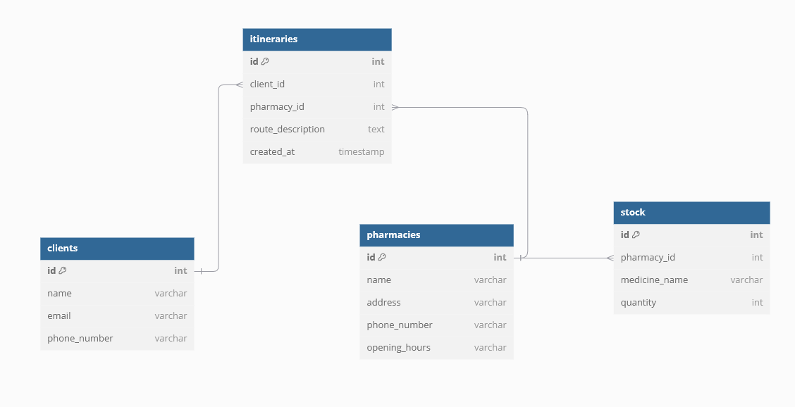

## Objectifs du système à modéliser: 
On propose de modéliser des microservices pour un système de pharmacie pour la vente de médicaments.

* Création et gestion des pharmacies:
 Les pharmaciens peuvent inscrire leur pharmacie et gérer les informations principales (adresse, horaires,...).
 Mise à jour du stock des médicaments disponibles.

* Recherche de médicaments:
 Les clients peuvent rechercher des médicaments par nom ou catégorie.
 Filtrer les résultats selon la ville et vérifier la disponibilité en temps réel.

* Vente de médicaments:
 Les clients peuvent acheter des médicaments en ligne ou réserver pour un retrait.
 Validation des conditions d'achat (par exemple, ordonnance téléversée si nécessaire).
 
* Commande et livraison:
 Choix entre retrait en pharmacie ou livraison (si possible).
 Suivi des commandes : en préparation, prête, livrée.
 
* Notifications:
 Alertes pour les clients (commande prête, statut de livraison).
 Notifications pour les pharmaciens sur les nouvelles commandes,saturation de stock.

* Service de gestion des ordonnances :
 Validation des conditions d'achat pour les médicaments soumis à ordonnance.
 Téléversement et vérification des ordonnances.

## Interfaces: 
Administrateurs -> Service Pharmacie : Créer/Mise à jour des infos pharmacie

Service Pharmacie -> Administrateurs : Confirmation (pharmacie créée/mise à jour)

Administrateurs -> Service Stock : Ajouter/Mise à jour stock médicaments

Service Stock -> Service Notifications : Alerte (stock bas)

Service Stock -> Administrateurs : Confirmation (stock mis à jour)

Client -> Service Recherche Médicaments : Rechercher médicaments (nom, catégorie, ville)

Service Recherche Médicaments -> Service Pharmacie : Obtenir pharmacies disponibles

Service Recherche Médicaments -> Client : Résultats (disponibilité, pharmacie)

Client -> Service Commande : Passer commande (liste médicaments, mode de livraison)

alt Ordonnance requise

Client -> Service Gestion Ordonnance : Téléverser ordonnance

Service Gestion Ordonnance -> Service Commande : Validation ordonnance

Service Commande -> Client : Confirmation ordonnance validée
end

Service Commande -> Service Stock : Vérification et mise à jour du stock

Service Commande -> Service Notifications : Alerte (nouvelle commande)

Service Commande -> Client : Confirmation commande (total, statut)

Client -> Service Livraison : Choisir livraison/retrait

Service Livraison -> Service Commande : Mise à jour du statut de commande (prête ou livraison en cours)

Service Livraison -> Client : Notification (statut commande)

Service Livraison -> Service Notifications : Alerte (commande prête, livraison en cours)

Service Notifications -> Client : Notification (commande prête ou en cours)

Service Notifications -> Administrateurs : Alerte (nouvelle commande, stock bas)

## Schéma relationnel :

## Exigences fonctionnelles
Le système DOIT permettre aux clients de rechercher des médicaments disponibles dans le stock.  
Le système NE DOIT proposer que les médicaments pour lesquels le stock est supérieur à zéro.  
Le système DOIT indiquer si un médicament nécessite une ordonnance avant l’achat.  
Le système DOIT permettre aux clients de télécharger une ordonnance pour valider l’achat des médicaments concernés.  
Le système DOIT permettre aux clients de créer un panier, de passer une commande, et de choisir un mode de livraison (retrait en pharmacie ou livraison à domicile).   
Le système DOIT permettre aux administrateurs (un pharmacien) de consulter et de mettre à jour les niveaux de stock des médicaments.  
Le système DOIT notifier les administrateurs lorsque le stock d’un médicament est critique.  
Le système DOIT permettre d’annuler une commande en cours et informer les clients de cette annulation.  
Le système DOIT checker si médicament dispo dans d’autres pharmacies aux alentours

## Exigences non fonctionnelles

Le système DOIT utiliser un messaging fiable pour garantir l’envoi des différentes notifications.   
Le système DOIT utiliser des microservices pour permettre une maintenance et une extension flexibles.
Le système Doit utiliser une gestion/architecture de base de données très robuste pour garantir une rapidité dans la lecture/traitement des données.
