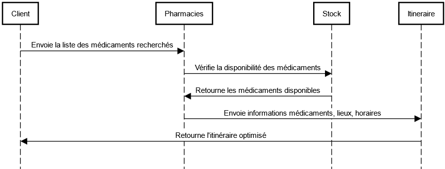

## Objectifs du système à modéliser: **Pharmacie**
### **Application pour Trouver un Meilleur Itinéraire pour l’Achat de Médicaments**
#### **Description des microservices :**

- **Microservice Client :**
   
   Envoi la liste des médicaments recherchés par l’utilisateur.

   Transmet la liste au microservice **Pharmacies**. 

   Récupère l’itinéraire final et l’affiche au client.

- **Microservice Pharmacies :**

   Gère les données des pharmacies inscrites :
   Nom, adresse, coordonnées GPS, horaires d’ouverture.

   Reçoit la liste des médicaments demandés par le microservice **Client**.
   
   Interroge le microservice **Stock** pour vérifier la disponibilité des médicaments dans les différentes pharmacies.
   
   Transmet les informations des médicaments disponibles (lieu, horaires d’ouverture) au microservice **Itinéraire**.

- **Microservice Stock :**

   Gère les stocks de médicaments pour chaque pharmacie.
   
   Répond au microservice **Pharmacies** en indiquant pour chaque médicament s’il est disponible ou non dans les pharmacies concernées.

- **Microservice Itinéraire :**
   
   Calcule le meilleur itinéraire pour récupérer les médicaments disponibles dans les pharmacies.

   Utilise les coordonnées GPS des pharmacies et la position du client.
   
   Retourne un itinéraire optimisé (liste des pharmacies à visiter, distances, et ordre de visite) au microservice **Client**.

## Interfaces: 
### **Interactions entre Microservices**

#### **Microservice Client -> Microservice Pharmacies :**
-  Le client envoie la liste des médicaments recherchés.

#### **Microservice Pharmacies -> Microservice Stock :**
-  Le microservice Pharmacies interroge le microservice Stock pour savoir si les médicaments demandés sont disponibles dans les pharmacies.

#### **Microservice Stock -> Microservice Pharmacies :**
-  Le microservice Stock indique pour chaque médicament s'il est disponible ou non dans les pharmacies concernées.

#### **Microservice Pharmacies -> Microservice Itinéraire :**
- Le microservice Pharmacies envoie les données des médicaments disponibles avec les informations nécessaires pour générer l'itinéraire.

#### **Microservice Itinéraire -> Microservice Client :**
-  Le microservice Itinéraire retourne un itinéraire optimisé (liste des pharmacies à visiter, distances, ordre de visite) au microservice Client.

## Schéma relationnel :

## Exigences Fonctionnelles

1. **Le microservice Client DOIT** transmettre la liste des médicaments recherchés au microservice Pharmacies.

2. **Le microservice Pharmacies DOIT** interroger le microservice Stock pour vérifier la disponibilité des médicaments demandés.

3. **Le microservice Stock DOIT** informer le microservice Pharmacies de la disponibilité des médicaments en temps réel (disponible ou non disponible).

4. **Le microservice Pharmacies DOIT** transmettre au microservice Itinéraire uniquement les médicaments disponibles, accompagnés des informations nécessaires (lieu et horaires d’ouverture des pharmacies).

5. **Le microservice Itinéraire DOIT** calculer l’itinéraire optimisé pour récupérer les médicaments disponibles dans les pharmacies et le retourner au microservice Client.

6. **Le microservice Client DOIT** recevoir l’itinéraire final, comprenant la liste des pharmacies à visiter, l'ordre des visites, et les distances.

## Exigences non fonctionnelles

1. Le système DOIT utiliser un messaging fiable pour garantir l’envoi des notifications de manière sécurisée et sans perte de données.
2. Le système DOIT être conçu de manière modulaire pour permettre une maintenance et une évolutivité faciles.
3. Le système DOIT utiliser une base de données robuste pour garantir la rapidité et l'efficacité dans le traitement des données.